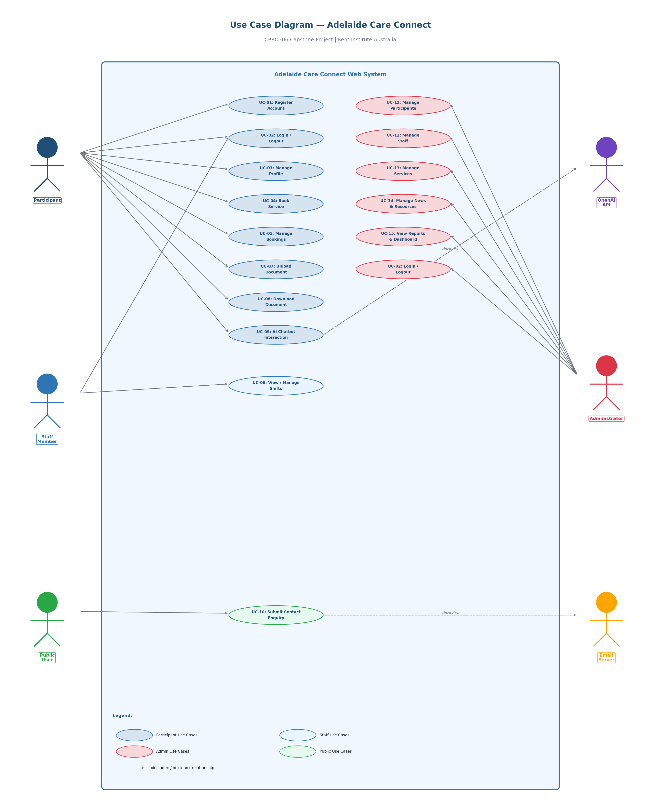
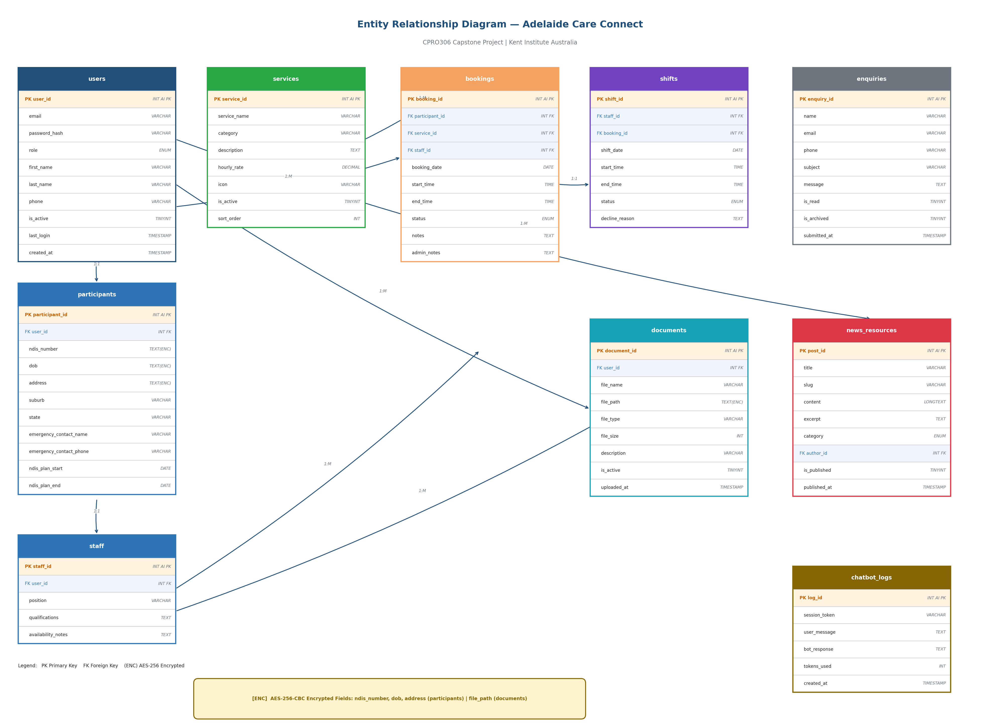
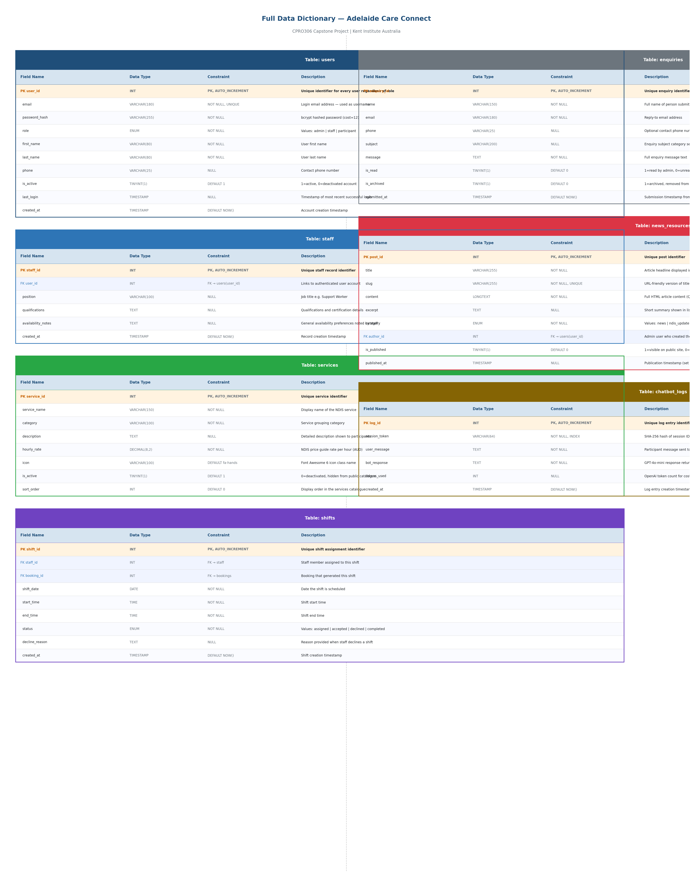
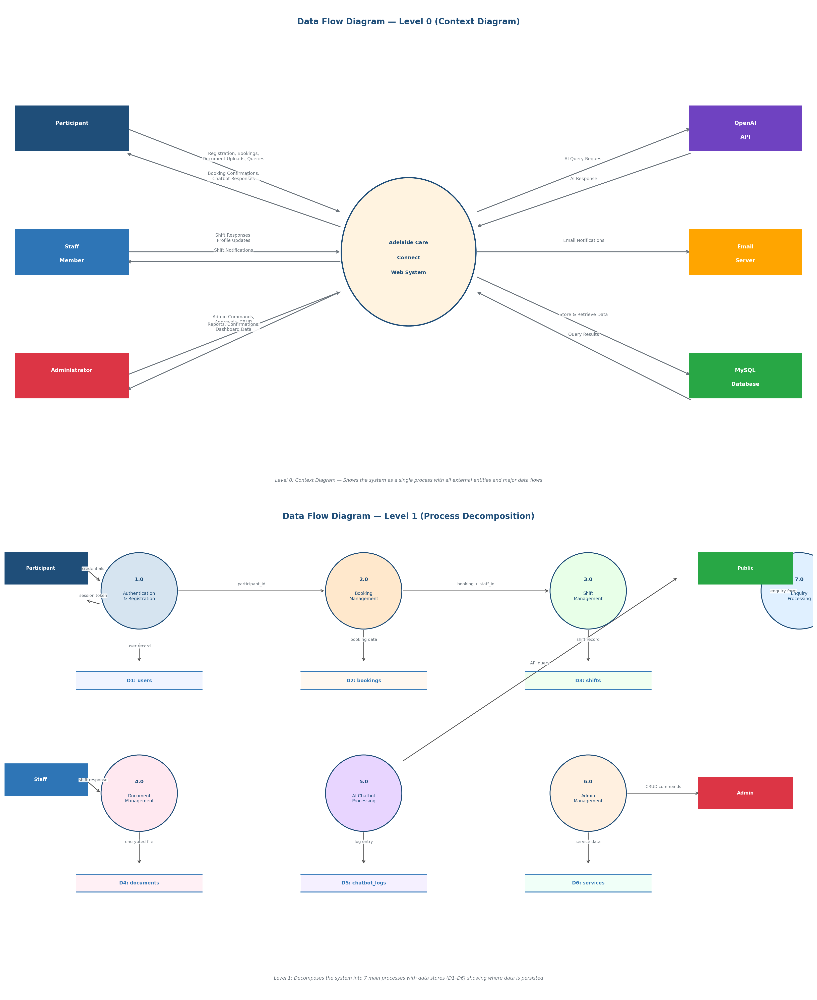
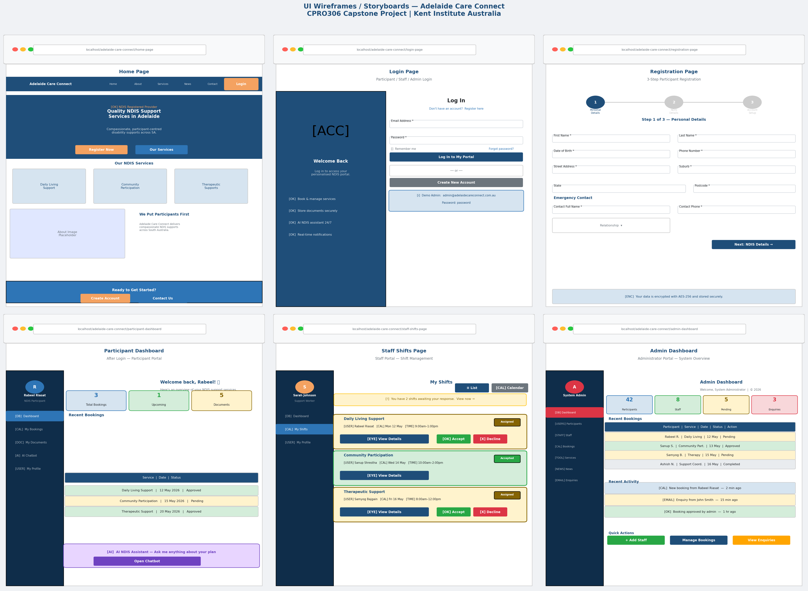

# Adelaide Care Connect — Software Requirements Specification

**NDIS Service Provider | Adelaide, South Australia**

> **Assessment 2 — SRS Report | CPRO306 Capstone Project | Kent Institute Australia**

---

## Team Members

| Name | Student ID | Role |
|---|---|---|
| Rabeel Riasat | K231661 | Project Manager |
| Sanup Shrestha | K230452 | Business Analyst |
| Samyog Bajgain | K232045 | Database Designer |
| Ashish Neupane | K250176 | Front-End Developer |
| Muman Ghale | K240793 | Back-End Developer |
| Bhushan | K250172 | QA & Documentation |

**Lecturer:** Mr Mehedi Hasan
**Industry Sponsor:** Skillup Labs — Nabin Singh (wil@skilluplabs.com.au)

---

## Table of Contents

1. [Project Description](#1-project-description)
2. [Team Structure and Workload Distribution](#2-team-structure-and-workload-distribution)
3. [System Requirements Analysis](#3-system-requirements-analysis)
4. [Functional and Non-Functional Requirements](#4-functional-and-non-functional-requirements)
5. [Database Design](#5-database-design)
6. [User Interface Design](#6-user-interface-design)
7. [Test Plan](#7-test-plan)
8. [System Architecture](#8-system-architecture)
9. [References](#9-references)
- [Appendix A — Use Case Diagram](#appendix-a--use-case-diagram)
- [Appendix B — Entity Relationship Diagram](#appendix-b--entity-relationship-diagram-erd)
- [Appendix C — Full Data Dictionary](#appendix-c--full-data-dictionary)
- [Appendix D — Data Flow Diagrams](#appendix-d--data-flow-diagrams)
- [Appendix E — UI Wireframes](#appendix-e--ui-wireframes--storyboards)

---

## 1. Project Description

### 1.1 Business Description

Adelaide Care Connect is a fictional NDIS (National Disability Insurance Scheme) registered service provider based in Adelaide, South Australia. The organisation offers a broad range of disability support services including daily living assistance, community participation, therapeutic supports, support coordination, and plan management. The organisation currently relies on manual processes and fragmented communication channels to manage client registrations, staff scheduling, and service delivery, leading to inefficiencies, data inconsistencies, and a diminished client experience.

The NDIS framework, governed by the National Disability Insurance Agency (NDIA), requires service providers to maintain transparent, accessible, and compliant record-keeping practices. Adelaide Care Connect recognises the strategic imperative of adopting a digital platform that aligns with NDIS Quality and Safeguarding Framework obligations while simultaneously improving operational efficiency and client outcomes.

### 1.2 Project Description and Problem Scenario

Adelaide Care Connect currently operates without a unified web-based information system. Client intake forms are paper-based, shift scheduling is performed via email and spreadsheets, and NDIS plan budgets are tracked manually. This results in the following pain points:

- Client data is siloed across multiple spreadsheets, increasing the risk of data loss and inconsistency.
- Staff members have no centralised portal to view, accept, or request changes to their scheduled shifts.
- Participants and their support coordinators cannot self-manage service bookings online, causing delays in service delivery.
- There is no mechanism for secure document storage, preventing timely access to NDIS plans, progress notes, and incident reports.
- Management lacks real-time dashboards for monitoring service utilisation, budget burn, and staff availability.

This project proposes the design and development of a full-stack web-based information system to address these challenges comprehensively.

### 1.3 Project Objectives

1. To provide a secure, role-based web platform for administrators, staff, and NDIS participants.
2. To digitise participant registration, profile management, and document storage.
3. To enable online service booking and scheduling with real-time staff availability.
4. To implement AI-powered chatbot functionality to answer participant queries about NDIS services.
5. To ensure data security through industry-standard encryption and compliance with the Australian Privacy Act 1988 and NDIS Practice Standards.
6. To deliver a responsive, accessible user interface compliant with WCAG 2.1 Level AA accessibility standards.
7. To facilitate staff management through a dedicated shift management portal.

### 1.4 Purpose of the System

The purpose of the Adelaide Care Connect web system is to centralise and digitise the organisation's core operational workflows. The system will serve as the primary digital touchpoint for participants seeking to register and manage their NDIS supports, for staff managing their schedules and client interactions, and for administrators overseeing organisational operations. The system aims to reduce administrative overhead by an estimated 40%, improve participant satisfaction through transparent self-service capabilities, and ensure regulatory compliance with NDIS obligations.

### 1.5 Scope Definition

**In Scope:**
- Public-facing website (Home, About, Services, News, Contact)
- Participant Portal: registration, profile management, service booking, document upload, AI chatbot
- Staff Portal: shift viewing, shift acceptance/rejection, and schedule management
- Admin Portal: participant management, staff management, service management, document management, and news/resources management

**Out of Scope:**
- Integration with NDIS myplace portal or NDIA payment systems
- Mobile application (iOS/Android) — web responsive design only
- Telehealth or video conferencing functionality
- Third-party payroll system integration

### 1.6 Proposed System Design Specifications

| Layer | Technology |
|---|---|
| **Front-End** | HTML5, CSS3, JavaScript (Vanilla) |
| **Back-End** | PHP 8.1+ (with PDO) |
| **Database** | MySQL 8.0 (managed via phpMyAdmin) |
| **Web Server** | Apache (XAMPP local; cPanel hosting) |
| **AI Integration** | OpenAI GPT-4o-mini API |
| **Security** | bcrypt (cost=12), AES-256-CBC encryption, HTTPS/SSL, PDO prepared statements |
| **Styling** | Custom CSS with responsive grid, accessibility-first design |

### 1.7 Development Methodology

The project will be developed using an **Agile Scrum** methodology adapted for academic delivery. The team will operate in two-week sprints aligned to the assessment submission schedule. Key Agile ceremonies include sprint planning, daily stand-ups (3× per week), sprint reviews, and retrospectives. Version control is managed through GitHub with a branching strategy (main → develop → feature branches).

The Agile approach was selected because it accommodates evolving requirements typical of NDIS service providers, enables continuous integration and testing, and facilitates transparent team collaboration.

---

## 2. Team Structure and Workload Distribution

### 2.1 Team Roles and Responsibilities

Each member contributes approximately **16.7%** of total project workload — all above the 25% threshold required for full assessment marks.

| Member | Role | Primary Tasks | Deliverables |
|---|---|---|---|
| **Rabeel Riasat** | Project Manager | Sprint planning, WBS, Gantt, risk log | Project plan, status reports, A2 coordination |
| **Sanup Shrestha** | Business Analyst | Requirements elicitation, use case diagrams, SRS writing | A2 SRS Report, A3 Presentation slides |
| **Samyog Bajgain** | Database Designer | ERD, data dictionary, SQL schema, DFD | Database design artefacts, SQL file |
| **Ashish Neupane** | Front-End Developer | HTML/CSS UI design, storyboards, responsive layouts | UI storyboards, all HTML/CSS pages |
| **Muman Ghale** | Back-End Developer | PHP logic, AI API integration, session management | PHP scripts, OpenAI chatbot integration |
| **Bhushan** | QA & Documentation | Test plan, test cases, implementation plan, DPIA | Test plan, DPIA report, user documentation |

### 2.2 Communication Plan

| Channel | Frequency | Purpose |
|---|---|---|
| Microsoft Teams | Daily async | Task updates, file sharing, questions |
| Weekly meeting (Mon) | 60 minutes | Sprint review, planning, blockers |
| GitHub Issues & PRs | Ongoing | Task tracking, code review, version control |
| Google Drive | Ongoing | SRS, presentations, design artefacts |

### 2.3 Work Breakdown Structure (WBS)

| WBS ID | Task Name | Owner | Est. Duration |
|---|---|---|---|
| **1.0** | **Project Initiation** | All | Week 1 |
| 1.1 | Project scope definition | Rabeel Riasat | Week 1 |
| 1.2 | Team roles and responsibilities | Rabeel Riasat | Week 1 |
| 1.3 | Communication plan | Rabeel Riasat | Week 1 |
| **2.0** | **Requirements Analysis (SRS)** | Members 2, 3 | Weeks 2–4 |
| 2.1 | Business and system requirements | Sanup Shrestha | Weeks 2–3 |
| 2.2 | Use case diagram | Sanup Shrestha | Week 3 |
| 2.3 | Functional & non-functional requirements | Sanup Shrestha | Week 3 |
| 2.4 | ERD, DFD, Data Dictionary | Samyog Bajgain | Weeks 3–4 |
| 2.5 | UI storyboards | Ashish Neupane | Week 4 |
| 2.6 | Test plan and DPIA | Bhushan | Week 4 |
| **3.0** | **System Development** | Members 4, 5 | Weeks 5–9 |
| 3.1 | Front-end HTML/CSS pages | Ashish Neupane | Weeks 5–7 |
| 3.2 | PHP back-end & MySQL integration | Muman Ghale | Weeks 6–8 |
| 3.3 | OpenAI chatbot integration | Muman Ghale | Week 8 |
| 3.4 | Data encryption & security | Muman Ghale | Week 8 |
| **4.0** | **Testing & Integration** | Member 6 | Weeks 9–11 |
| 4.1 | Unit and integration testing | Bhushan | Weeks 9–10 |
| 4.2 | User acceptance testing (UAT) | All | Week 10 |
| 4.3 | Bug fixing and documentation | All | Week 11 |
| **5.0** | **Deployment & Presentation** | All | Weeks 11–12 |
| 5.1 | Deployment & final documentation | Rabeel Riasat & Bhushan | Week 11 |
| 5.2 | Formal demonstration preparation | All | Week 12 |

### 2.4 Gantt Chart

| Task | W1 | W2 | W3 | W4 | W5 | W6 | W7 | W8 | W9 | W10 | W11 | W12 |
|---|---|---|---|---|---|---|---|---|---|---|---|---|
| 1. Project Initiation | ██ | ██ | | | | | | | | | | |
| 2. Requirements / SRS | ██ | ██ | ██ | ██ | | | | | | | | |
| 3. SRS Presentation | | | | ██ | ██ | | | | | | | |
| 4. Front-End Development | | | | | ██ | ██ | ██ | | | | | |
| 5. Back-End Development | | | | | | ██ | ██ | ██ | | | | |
| 6. AI Chatbot Integration | | | | | | | ██ | ██ | | | | |
| 7. Database Implementation | | | | | ██ | ██ | ██ | | | | | |
| 8. Testing & QA | | | | | | | | | ██ | ██ | | |
| 9. End-of-Project Report | | | | | | | | | | ██ | ██ | |
| 10. Formal Demonstration | | | | | | | | | | | | ██ |

---

## 3. System Requirements Analysis

### 3.1 Business Requirements

| BR-ID | Business Requirement | Priority |
|---|---|---|
| **BR-01** | The system shall provide a public-facing website accessible to NDIS participants and their nominees. | High |
| **BR-02** | The system shall allow participants to register, login, and manage their personal profiles securely. | High |
| **BR-03** | The system shall enable participants to book and manage disability support services online. | High |
| **BR-04** | The system shall provide staff with a dedicated portal to view and manage their shift schedules. | High |
| **BR-05** | The system shall allow secure document upload, storage, and retrieval for participants and staff. | High |
| **BR-06** | The system shall incorporate an AI-powered chatbot to respond to NDIS-related participant queries. | Medium |
| **BR-07** | The system shall provide an administrative portal with full CRUD capabilities across all modules. | High |
| **BR-08** | The system shall maintain a news and resources section updatable by administrators. | Medium |
| **BR-09** | The system shall comply with the Australian Privacy Act 1988 and NDIS Practice Standards. | High |
| **BR-10** | The system shall implement data encryption to protect sensitive participant health and financial data. | High |

### 3.2 Hardware Requirements

| Component | Development (Minimum) | Production Server (Minimum) |
|---|---|---|
| **Processor** | Intel Core i5 / AMD Ryzen 5 | Intel Xeon E3 or equivalent |
| **RAM** | 8 GB | 16 GB |
| **Storage** | 256 GB SSD | 100 GB SSD (scalable) |
| **Network** | Broadband (10 Mbps+) | 1 Gbps dedicated |
| **Operating System** | Windows 10/11 or Ubuntu 20.04+ | Ubuntu Server 22.04 LTS |

### 3.3 Software Requirements

| Software | Version | Purpose |
|---|---|---|
| **XAMPP / WAMP** | 8.x | Local development server (Apache + MySQL + PHP) |
| **PHP** | 8.1+ | Server-side scripting |
| **MySQL** | 8.0+ | Relational database management |
| **phpMyAdmin** | 5.x | Database GUI for development |
| **Visual Studio Code** | Latest | Primary code editor |
| **Git / GitHub** | Latest | Version control and collaboration |
| **OpenAI API (GPT-4o-mini)** | Latest | AI chatbot integration |
| **Google Chrome / Firefox** | Latest | Browser testing |
| **W3C Validator** | Online | HTML/CSS validation |

### 3.4 User Requirement Analysis — Use Case Overview

The system has three primary user roles: **Participant** (NDIS client), **Staff** (support worker), and **Administrator**. External systems include **OpenAI API** (chatbot) and **Email Server**.

#### 3.4.1 Use Case Descriptions

| UC-ID | Use Case Name | Actor(s) | Description |
|---|---|---|---|
| **UC-01** | Register Account | Participant | New participant registers with personal, contact, and NDIS plan details. |
| **UC-02** | Login / Logout | Participant, Staff, Admin | Authenticated users log in with email/password; sessions expire after 30 min inactivity. |
| **UC-03** | Manage Profile | Participant, Staff | Users view and update personal information, emergency contacts, and preferences. |
| **UC-04** | Book Service | Participant | Participant selects a service type, preferred date/time, and staff member and submits a booking request. |
| **UC-05** | Manage Bookings | Participant, Admin | View, modify, or cancel existing service bookings. |
| **UC-06** | View / Manage Shifts | Staff | Staff view assigned shifts, accept or decline shifts, and request schedule changes. |
| **UC-07** | Upload Document | Participant, Staff, Admin | Users securely upload NDIS plans, progress notes, or incident reports (PDF/DOC, max 10 MB). |
| **UC-08** | Download / View Document | Participant, Staff, Admin | Authorised users retrieve their own or assigned documents. |
| **UC-09** | AI Chatbot Interaction | Participant | Participant types a query; the OpenAI-powered chatbot provides an NDIS-related response. |
| **UC-10** | Submit Contact Enquiry | Public User | Visitor submits an enquiry form; admin receives email notification. |
| **UC-11** | Manage Participants | Admin | Admin views, edits, activates, or deactivates participant accounts and reviews profiles. |
| **UC-12** | Manage Staff | Admin | Admin creates, edits, deactivates staff accounts and assigns roles and services. |
| **UC-13** | Manage Services | Admin | Admin defines, edits, or deactivates service types, pricing, and availability. |
| **UC-14** | Manage News/Resources | Admin | Admin creates, edits, or deletes news articles and resource documents visible to the public. |
| **UC-15** | View Reports/Dashboard | Admin | Admin views dashboards showing booking statistics, budget usage, staff utilisation. |

> See **[Appendix A](#appendix-a--use-case-diagram)** for the full UML Use Case Diagram.

---

## 4. Functional and Non-Functional Requirements

### 4.1 Functional Requirements

| FR-ID | Description | Priority | UC Ref | Module |
|---|---|---|---|---|
| **FR-01** | The system shall allow new participants to register with name, DOB, email, phone, NDIS number, address, and emergency contact. | High | UC-01 | Auth |
| **FR-02** | The system shall validate NDIS number format (9-digit numeric) upon registration. | High | UC-01 | Auth |
| **FR-03** | The system shall authenticate users with email and bcrypt-hashed password. | High | UC-02 | Auth |
| **FR-04** | The system shall implement role-based access control (RBAC) with three roles: Participant, Staff, Administrator. | High | UC-02 | Auth |
| **FR-05** | The system shall allow participants to update their profile details, emergency contacts, and communication preferences. | High | UC-03 | Participant |
| **FR-06** | The system shall display available services filtered by category, location, and date. | High | UC-04 | Booking |
| **FR-07** | The system shall allow participants to submit booking requests that enter a 'Pending' state awaiting admin approval. | High | UC-04 | Booking |
| **FR-08** | The system shall send email confirmation to participants upon booking approval or rejection. | Medium | UC-05 | Booking |
| **FR-09** | The system shall allow participants to cancel bookings at least 24 hours in advance. | High | UC-05 | Booking |
| **FR-10** | The system shall display a staff member's weekly shift schedule in a calendar-style view. | High | UC-06 | Staff |
| **FR-11** | The system shall allow staff to accept or decline assigned shifts with a reason field for declines. | High | UC-06 | Staff |
| **FR-12** | The system shall allow staff to submit shift swap requests to the administrator. | Medium | UC-06 | Staff |
| **FR-13** | The system shall allow authenticated users to upload documents (PDF/DOCX, max 10 MB) associated with their profile. | High | UC-07 | Documents |
| **FR-14** | The system shall enforce document access control so participants can only access their own documents. | High | UC-08 | Documents |
| **FR-15** | The system shall integrate the OpenAI GPT API to power a participant-facing chatbot. | High | UC-09 | Chatbot |
| **FR-16** | The system shall retain the last 10 chatbot messages in session memory for context continuity. | Medium | UC-09 | Chatbot |
| **FR-17** | The system shall provide a public contact/enquiry form with name, email, phone, and message fields. | Medium | UC-10 | Public |
| **FR-18** | The system shall send enquiry form submissions to the admin email address using PHP mail or SMTP. | Medium | UC-10 | Public |
| **FR-19** | The system shall provide administrators with CRUD operations for participant and staff accounts. | High | UC-11, 12 | Admin |
| **FR-20** | The system shall provide administrators with a dashboard displaying booking KPIs, staff availability, and document counts. | High | UC-15 | Admin |

### 4.2 Non-Functional Requirements

| NFR-ID | Category | Requirement | Metric |
|---|---|---|---|
| **NFR-01** | Performance | Pages shall load within 3 seconds on a standard broadband connection. | < 3 seconds |
| **NFR-02** | Security | All passwords shall be hashed using bcrypt with a cost factor of 12. | bcrypt cost = 12 |
| **NFR-03** | Security | Sensitive data fields (NDIS number, health data) shall be encrypted using AES-256-CBC. | AES-256 |
| **NFR-04** | Security | All form inputs shall be sanitised and parameterised to prevent SQL injection and XSS attacks. | OWASP Top 10 |
| **NFR-05** | Security | The system shall enforce HTTPS for all data transmission. | SSL/TLS 1.3 |
| **NFR-06** | Availability | The production system shall achieve 99% uptime during business hours (8am–6pm ACST). | 99% uptime |
| **NFR-07** | Usability | The system shall comply with WCAG 2.1 Level AA accessibility guidelines. | WCAG 2.1 AA |
| **NFR-08** | Usability | The interface shall be responsive across desktop, tablet, and mobile viewports. | 320px to 1920px |
| **NFR-09** | Scalability | The database shall support at least 1,000 concurrent participant records without degradation. | 1,000+ records |
| **NFR-10** | Maintainability | All PHP functions shall include inline comments and follow PSR-12 coding standards. | PSR-12 |
| **NFR-11** | Compatibility | The system shall function correctly on Chrome, Firefox, Edge, and Safari (latest 2 versions). | 4 browsers |
| **NFR-12** | Privacy | The system shall implement a DPIA in compliance with Australian Privacy Principles. | APP compliance |

---

## 5. Database Design

### 5.1 Database Architecture

The Adelaide Care Connect system uses **MySQL 8.0** as its relational database management system. The database follows **Third Normal Form (3NF)** to eliminate data redundancy and maintain data integrity. All queries use **PDO prepared statements** to prevent SQL injection.

### 5.2 Entity Relationship Diagram (ERD)

#### Core Entities and Primary Keys

| Entity (Table) | Primary Key | Key Attributes |
|---|---|---|
| **users** | user_id (INT, AI) | email, password_hash, role (ENUM: admin/staff/participant), is_active, created_at |
| **participants** | participant_id (INT, AI) | user_id (FK), ndis_number (ENC), dob (ENC), address (ENC), emergency_contact_name, emergency_contact_phone |
| **staff** | staff_id (INT, AI) | user_id (FK), position, qualifications, availability_notes |
| **services** | service_id (INT, AI) | service_name, category, description, hourly_rate, is_active |
| **bookings** | booking_id (INT, AI) | participant_id (FK), service_id (FK), staff_id (FK), booking_date, start_time, end_time, status (ENUM), notes |
| **shifts** | shift_id (INT, AI) | staff_id (FK), booking_id (FK), shift_date, start_time, end_time, status (ENUM: assigned/accepted/declined), decline_reason |
| **documents** | document_id (INT, AI) | user_id (FK), file_name, file_path (ENC), file_type, upload_date, is_active |
| **enquiries** | enquiry_id (INT, AI) | name, email, phone, message, submitted_at, is_read |
| **news_resources** | post_id (INT, AI) | title, content, category, author_id (FK), published_at, is_published |
| **chatbot_logs** | log_id (INT, AI) | session_token (anon), user_message, bot_response, tokens_used, created_at |

> `(ENC)` = AES-256-CBC encrypted at application layer before storage.

> See **[Appendix B](#appendix-b--entity-relationship-diagram-erd)** for the full ERD diagram.

### 5.3 Data Dictionary

#### Table: `participants`

| Field Name | Data Type | Constraint | Description |
|---|---|---|---|
| `participant_id` | INT | PK, AUTO_INCREMENT | Unique identifier for each participant record |
| `user_id` | INT | FK → users(user_id) | Links participant profile to authenticated user account |
| `ndis_number` | VARCHAR(255) | NOT NULL, UNIQUE | AES-256 encrypted 9-digit NDIS participant number |
| `dob` | DATE | NOT NULL | Date of birth — used for age verification |
| `address` | TEXT | NOT NULL | Residential address encrypted at application layer |
| `emergency_contact_name` | VARCHAR(100) | NOT NULL | Full name of emergency contact person |
| `emergency_contact_phone` | VARCHAR(20) | NOT NULL | Emergency contact phone number |
| `ndis_plan_start` | DATE | NULL | Start date of participant's current NDIS plan |
| `ndis_plan_end` | DATE | NULL | End date of participant's current NDIS plan |
| `created_at` | TIMESTAMP | DEFAULT NOW() | Record creation timestamp |

#### Table: `bookings`

| Field Name | Data Type | Constraint | Description |
|---|---|---|---|
| `booking_id` | INT | PK, AUTO_INCREMENT | Unique identifier for each booking |
| `participant_id` | INT | FK → participants | References the participant making the booking |
| `service_id` | INT | FK → services | References the type of service being booked |
| `staff_id` | INT | FK → staff, NULL | References assigned staff member (nullable until assigned) |
| `booking_date` | DATE | NOT NULL | Requested date of service delivery |
| `start_time` | TIME | NOT NULL | Requested start time of service |
| `end_time` | TIME | NOT NULL | Requested end time of service |
| `status` | ENUM | NOT NULL | Values: pending, approved, rejected, cancelled, completed |
| `notes` | TEXT | NULL | Additional participant notes or requirements |
| `created_at` | TIMESTAMP | DEFAULT NOW() | Booking submission timestamp |

> See **[Appendix C](#appendix-c--full-data-dictionary)** for the full Data Dictionary covering all 10 tables.

### 5.4 Data Flow Diagram (DFD)

#### Level 0 — Context Diagram

- **External Entities:** Participant, Staff Member, Administrator, OpenAI API, Email Server
- **Data Flows IN:** Registration data, login credentials, booking requests, document uploads, shift responses, admin management commands, AI queries
- **Data Flows OUT:** Booking confirmations, shift notifications, AI chatbot responses, reports/dashboards, email notifications

> See **[Appendix D](#appendix-d--data-flow-diagrams)** for the full Level 0 and Level 1 DFD diagrams.

### 5.5 Data Encryption and Anonymisation

In compliance with the **Australian Privacy Principles (APPs)** under the Privacy Act 1988 and NDIS Practice Standards:

- **AES-256-CBC Encryption:** Fields `ndis_number`, `dob`, `address`, and uploaded `file_path` values are encrypted at the application layer using PHP's OpenSSL extension before being stored in MySQL.
- **bcrypt Password Hashing:** All passwords hashed using `password_hash()` with `PASSWORD_BCRYPT` and cost factor 12. Plaintext passwords are never stored.
- **Data Anonymisation:** Chatbot logs replace participant names with hashed session tokens — no PII stored in logs.
- **Minimum-Privilege DB User:** A dedicated MySQL application user is granted only SELECT, INSERT, UPDATE, DELETE on the application database. The root account is never used in application code.
- **Secure File Storage:** Uploaded documents are stored outside the web root in a protected directory, accessible only via authenticated PHP file-serving scripts.

### 5.6 Data Protection Impact Assessment (DPIA)

Performed in accordance with the OAIC's Guide to Data Analytics and the Privacy Act 1988.

| Risk ID | Privacy Risk | Likelihood | Mitigation |
|---|---|---|---|
| **PR-01** | Unauthorised access to participant NDIS and health data | Medium | AES-256 encryption, RBAC, session management |
| **PR-02** | SQL injection attack exposing database records | Medium | PDO prepared statements on all queries |
| **PR-03** | Cross-site scripting (XSS) via user-input fields | Medium | `htmlspecialchars()` on all output; CSP headers |
| **PR-04** | Unauthorised document access by other participants | Low | User-bound document access control in PHP |
| **PR-05** | Data breach via insecure file uploads | Low | File type validation, storage outside web root |
| **PR-06** | AI chatbot logging sensitive participant queries | Medium | Session-ID anonymisation; no PII stored in logs |
| **PR-07** | Data held longer than necessary | Low | Inactive records archived after 7 years per NDIS guidelines |

---

## 6. User Interface Design

### 6.1 UI Design Principles

- **Accessibility First:** WCAG 2.1 Level AA compliance — minimum 4.5:1 colour contrast ratio, keyboard-navigable, ARIA labels on all interactive elements.
- **Responsive Design:** Mobile-first CSS grid layout adapting to 320px (mobile), 768px (tablet), and 1440px (desktop) breakpoints.
- **Consistency:** Shared component library (navbar, footer, card components, form styles, button variants) applied across all pages.
- **Plain Language:** Content written at a reading age of 8–10 years in compliance with NDIS Easy Read guidelines.

### 6.2 Colour Scheme and Typography

| Element | Value | Usage |
|---|---|---|
| **Primary Colour** | `#1F4E79` (Navy Blue) | Navigation bar, headings, primary buttons |
| **Secondary Colour** | `#2E75B6` (Mid Blue) | Sub-headings, hover states, links |
| **Accent Colour** | `#F4A261` (Warm Orange) | Call-to-action buttons, highlights |
| **Background** | `#F8F9FA` (Off White) | Page background |
| **Text Primary** | `#212529` (Near Black) | Body text |
| **Success** | `#28A745` (Green) | Booking confirmations, success alerts |
| **Error** | `#DC3545` (Red) | Form validation errors, warnings |
| **Font — Headings** | Poppins (Google Fonts) | All h1–h4 elements |
| **Font — Body** | Open Sans (Google Fonts) | All body text, form labels |
| **Base Font Size** | 16px (1rem) | Minimum for accessibility compliance |

### 6.3 UI Storyboard — Page Descriptions

#### 6.3.1 Public Website Pages

| Page | Description |
|---|---|
| **Home (index.php)** | Hero banner with headline, CTA buttons. Services overview cards (6 categories). About section. Testimonials carousel. Footer with contact info. |
| **About (about.php)** | Mission statement. Organisational values. Team section with staff profile cards. NDIS registered provider badge. |
| **Services (services.php)** | Filterable service catalogue by category. Each card shows: title, icon, description, hourly rate, 'Book Now' CTA. |
| **News (news.php)** | Paginated news article listings. Category filter (News, NDIS Updates, Health Tips, Resources). Individual article view. |
| **Contact (contact.php)** | Contact form (name, email, phone, message, subject). Google Maps embed. Business hours and phone number. |
| **Register (register.php)** | Multi-step form: Step 1 (Personal Details), Step 2 (NDIS Details), Step 3 (Account Setup). Progress indicator bar. |
| **Login (login.php)** | Email and password fields. 'Remember me' checkbox. Role-based redirect post-login. |

#### 6.3.2 Participant Portal Pages

| Page | Description |
|---|---|
| **Dashboard** | Welcome banner, KPI cards (active bookings, upcoming appointments, documents, chatbot). Recent activity feed. |
| **Book a Service** | Service category selector. Available dates. Time slot picker. Staff preference dropdown. Booking summary and confirm. |
| **My Bookings** | Tabbed view: Upcoming \| Past \| Cancelled. Booking cards with service type, date/time, assigned staff, status badge. |
| **My Documents** | Drag-and-drop upload zone. Document list with file name, type icon, upload date, download/delete buttons. |
| **AI Chatbot** | Chat interface with message history. Input text box. Quick-reply suggestion chips. General information disclaimer. |
| **My Profile** | Editable personal details form. Emergency contact section. Password change panel. |

#### 6.3.3 Staff Portal Pages

| Page | Description |
|---|---|
| **Dashboard** | Weekly shift count, upcoming shifts, pending shift requests. Quick actions. |
| **My Shifts** | Weekly calendar view with colour-coded shifts. List view toggle. Accept / Decline / View Detail action buttons. |
| **Shift Detail** | Full shift information: participant details, service notes, address, contact info. Accept/Decline form with comment. |
| **My Profile** | Personal details, qualifications, availability preferences. Password change. |

#### 6.3.4 Admin Portal Pages

| Page | Description |
|---|---|
| **Dashboard** | KPI cards: total participants, active staff, bookings this week, pending approvals, open enquiries. Activity log. |
| **Manage Participants** | Searchable data table. Columns: name, NDIS number (masked), status, plan expiry, last login. View/Edit/Deactivate actions. |
| **Manage Staff** | Staff table with role, upcoming shifts count. Add New Staff form modal. |
| **Manage Bookings** | All bookings filterable by status. Approve/Reject pending bookings with staff assignment → auto-creates shift. |
| **Manage Documents** | Document library with owner, type, upload date filters. Storage usage indicator. |
| **Manage Services** | Full CRUD service catalogue. Activate/deactivate services without deletion. |
| **Manage News** | Rich text editor (Quill WYSIWYG). Category assignment. Publish/unpublish toggle. |
| **Enquiries** | Contact form submissions table. Mark read/unread. Archive closed enquiries. Reply via email link. |

> See **[Appendix E](#appendix-e--ui-wireframes--storyboards)** for full wireframe diagrams of all 6 key pages.

---

## 7. Test Plan

### 7.1 Testing Strategy

Testing adopts a **4-layer approach** aligned to Agile development:

1. **Unit Testing** — Individual PHP functions and database queries tested in isolation.
2. **Integration Testing** — Combined testing of front-end forms with PHP handlers and MySQL database.
3. **System Testing** — End-to-end testing of all user workflows across all three roles.
4. **User Acceptance Testing (UAT)** — Walkthrough testing by simulated user personas to validate business requirements.

### 7.2 Test Cases

| TC-ID | Module | Test Scenario | Expected Result | Pass Criteria |
|---|---|---|---|---|
| **TC-01** | Registration | Submit registration with valid NDIS number (9 digits) | Account created; redirect to dashboard | HTTP 200, user record in DB |
| **TC-02** | Registration | Submit registration with invalid NDIS number (letters) | Validation error displayed inline | Error message visible, no DB record |
| **TC-03** | Authentication | Login with correct email and password | User authenticated, role-based redirect | Session contains user_id and role |
| **TC-04** | Authentication | Login with incorrect password | Error message; account not accessed | No session created, error shown |
| **TC-05** | Booking | Submit service booking for future date | Booking created with 'Pending' status | Booking in DB, confirmation email sent |
| **TC-06** | Booking | Cancel booking within 24 hours of service | Cancellation blocked with message | Booking status unchanged |
| **TC-07** | Staff — Shifts | Staff accepts assigned shift | Shift status updates to 'Accepted' | DB status = 'accepted' |
| **TC-08** | Staff — Shifts | Staff declines shift with reason | Shift status updates to 'Declined'; reason saved | DB status = 'declined', reason stored |
| **TC-09** | Documents | Upload valid PDF under 10 MB | File stored, record in documents table | File accessible via PHP script |
| **TC-10** | Documents | Upload file exceeding 10 MB | Upload rejected with error message | No file stored, error displayed |
| **TC-11** | AI Chatbot | Submit NDIS-related query | GPT API returns relevant response | Response displayed in chat within 5 sec |
| **TC-12** | Admin | Admin approves pending booking | Booking status → 'approved'; staff shift created | DB updated, staff receives notification |
| **TC-13** | Security | Attempt SQL injection in login form | Input sanitised; login fails safely | No DB error; OWASP test passes |
| **TC-14** | Security | Access participant document URL without auth | Redirect to login page | HTTP 302 redirect |
| **TC-15** | Accessibility | Run WAVE accessibility tool on home page | No critical accessibility errors | 0 WAVE errors, ≤ 5 warnings |

### 7.3 Implementation Plan

| Phase | Activity | Details | Timeline |
|---|---|---|---|
| **1** | Environment Setup | Configure XAMPP; create GitHub repo; set up branch structure; create MySQL database with schema. | Week 1 |
| **2** | Front-End Development | Build all HTML/CSS pages per UI storyboard; implement responsive layouts; add JavaScript validation. | Weeks 5–7 |
| **3** | Back-End Development | Implement PHP authentication, session management, CRUD operations for all modules, PDO database layer. | Weeks 6–8 |
| **4** | AI Integration | Integrate OpenAI GPT API; build chatbot UI; implement session-based conversation history. | Week 8 |
| **5** | Security Implementation | Apply AES-256 encryption to sensitive fields; enforce HTTPS; implement CSRF tokens; set security headers. | Weeks 8–9 |
| **6** | Testing | Execute all test cases (TC-01 to TC-15); fix bugs; validate HTML/CSS with W3C; run WAVE accessibility check. | Weeks 9–10 |
| **7** | Documentation | Finalise user manual, help documentation, system admin guide, and deployment checklist. | Week 11 |
| **8** | Production Deployment | Deploy to cPanel hosting; configure SSL certificate; perform smoke testing on live environment. | Week 11 |
| **9** | Formal Demonstration | Conduct live demonstration of all system features to academic and industry supervisors. | Week 12 |

---

## 8. System Architecture

### 8.1 Three-Tier Architecture

The system follows a standard **Three-Tier web architecture**:

- **Presentation Tier (Client):** HTML5/CSS3/JavaScript running in the user's browser. Handles UI rendering, client-side form validation, and AJAX requests for chatbot interaction.
- **Application Tier (Server):** PHP 8.1 running on Apache web server. Processes business logic, enforces security rules, manages sessions, communicates with the database, and interfaces with the OpenAI API.
- **Data Tier (Database):** MySQL 8.0 managed by phpMyAdmin. Stores all persistent application data with referential integrity enforced through foreign keys.

### 8.2 Project File/Folder Structure

```
adelaide-care-connect/
├── config/
│   ├── db.php              ← PDO database connection (singleton)
│   ├── config.php          ← App constants, AES-256 helpers, CSRF, flash
│   └── openai.php          ← OpenAI API key (not committed to GitHub)
├── includes/
│   ├── header.php          ← Global navbar, flash messages, <head>
│   ├── footer.php          ← Footer, JS includes
│   └── auth_check.php      ← Session guard, RBAC, redirect helpers
├── controllers/
│   └── AuthController.php  ← Login, register, logout logic
├── models/
│   ├── User.php            ← User auth, profile, registration
│   ├── Booking.php         ← Service bookings
│   ├── Document.php        ← Secure file upload/download/delete
│   ├── Shift.php           ← Staff shift management
│   └── Admin.php           ← All admin-level DB operations
├── assets/
│   ├── css/style.css       ← Complete CSS design system
│   └── js/main.js          ← Navbar, forms, chatbot UI, animations
├── participant/            ← Participant portal pages + ajax/
├── staff/                  ← Staff portal pages
├── admin/                  ← Admin portal pages + includes/
├── errors/                 ← Custom 404.php, 403.php
├── uploads/documents/      ← Encrypted file storage (blocked from web)
├── database/
│   └── schema.sql          ← Full database schema + seed data
├── index.php               ← Public home page
├── about.php, services.php, news.php, contact.php
├── login.php, register.php, logout.php
├── .htaccess               ← Apache security headers, directory blocking
└── README.md               ← Setup and installation guide
```

---

## 9. References

1. Australian Government, Department of Social Services 2013, *National Disability Insurance Scheme Act 2013*, Commonwealth of Australia, Canberra, viewed April 2026, <https://www.legislation.gov.au/Details/C2013A00020>.

2. National Disability Insurance Agency (NDIA) 2022, *NDIS Practice Standards and Quality Indicators*, NDIA, Canberra, viewed April 2026, <https://www.ndis.gov.au/providers/working-provider/provider-registration/ndis-practice-standards>.

3. Office of the Australian Information Commissioner (OAIC) 2019, *Guide to Data Analytics and the Australian Privacy Principles*, OAIC, Sydney, viewed April 2026, <https://www.oaic.gov.au/privacy/guidance-and-advice/guide-to-data-analytics-and-the-australian-privacy-principles>.

4. Pressman, R.S. & Maxim, B.R. 2020, *Software Engineering: A Practitioner's Approach*, 9th edn, McGraw-Hill Education, New York.

5. Sommerville, I. 2016, *Software Engineering*, 10th edn, Pearson Education, Harlow, England.

6. W3C Web Accessibility Initiative 2018, *Web Content Accessibility Guidelines (WCAG) 2.1*, World Wide Web Consortium, viewed April 2026, <https://www.w3.org/TR/WCAG21/>.

7. OpenAI 2024, *GPT-4o API Documentation*, OpenAI, San Francisco, viewed April 2026, <https://platform.openai.com/docs>.

---

## Appendix A — Use Case Diagram



*Figure A.1: UML Use Case Diagram — Adelaide Care Connect (UC-01 to UC-15)*

The diagram illustrates all four actors (Participant, Staff, Administrator, OpenAI API / Email Server) and their 15 associated use cases, including `<<include>>` and `<<extend>>` relationships.

---

## Appendix B — Entity Relationship Diagram (ERD)



*Figure B.1: Entity Relationship Diagram — 10 Tables, Crow's Foot Notation*

All 10 entities, their attributes, and relationships (one-to-many, one-to-one) are shown with cardinality notations. AES-256 encrypted fields are annotated.

---

## Appendix C — Full Data Dictionary



*Figure C.1: Full Data Dictionary — All Tables with Field Definitions*

Covers all fields for all 10 database tables including data types, constraints, and descriptions. Key tables (`participants`, `bookings`) are also documented in Section 5.3.

---

## Appendix D — Data Flow Diagrams



*Figure D.1: Data Flow Diagram — Level 0 (Context) and Level 1 (Process Decomposition)*

**Level 0** shows the system as a single process with all external entities and major data flows. **Level 1** decomposes the system into 7 main processes (Authentication, Booking Management, Shift Management, Document Management, AI Chatbot Processing, Admin Management, Enquiry Processing) with 6 named data stores (D1–D6).

---

## Appendix E — UI Wireframes / Storyboards



*Figure E.1: UI Wireframes / Storyboards — 6 Key Pages across All Portals*

Wireframes shown: Home Page, Login Page, 3-Step Registration, Participant Dashboard, Staff Shifts Page (calendar view), Admin Dashboard.

---

*Adelaide Care Connect | CPRO306 Capstone Project | Kent Institute Australia | April 2026*
