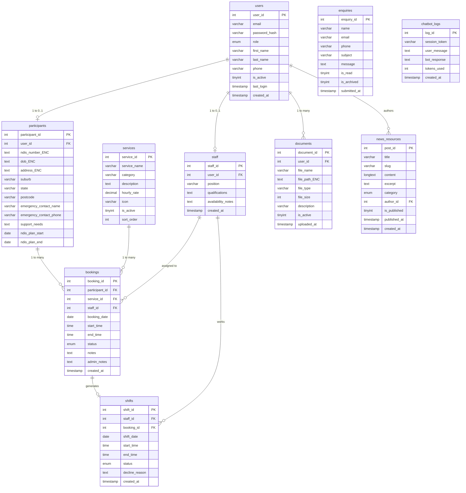
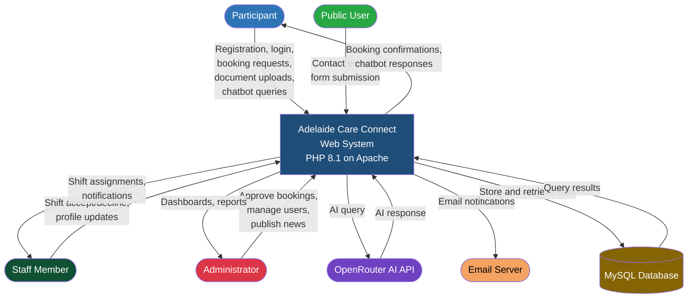
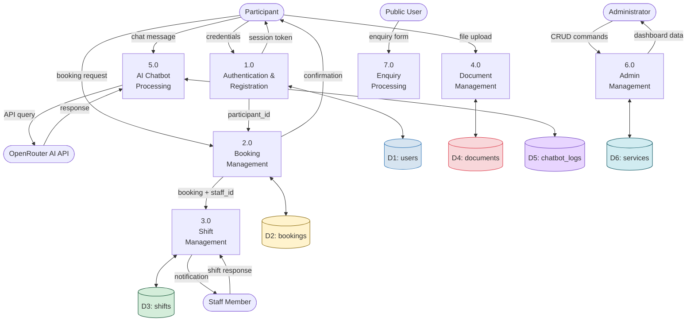

# Week 5 — Database & API Design
## Adelaide Care Connect | CPRO306 Capstone Project
**Kent Institute Australia | Team: Group 8 | 2026**


## 1. Database Overview

| Property | Value |
|---|---|
| **Database Name** | `adelaide_care_connect` |
| **Database Engine** | MySQL 8.0 |
| **Normalisation Level** | Third Normal Form (3NF) |
| **Total Tables** | 10 |
| **Connection Method** | PHP PDO with prepared statements |
| **Sensitive Field Encryption** | AES-256-CBC (application layer) |
| **Password Hashing** | bcrypt (cost = 12) |

### Tables at a Glance

| # | Table Name | Purpose |
|---|---|---|
| 1 | `users` | Central authentication for all roles |
| 2 | `participants` | Extended NDIS participant profiles |
| 3 | `staff` | Support worker profiles and qualifications |
| 4 | `services` | NDIS service catalogue |
| 5 | `bookings` | Participant service booking requests |
| 6 | `shifts` | Staff shift assignments linked to bookings |
| 7 | `documents` | Encrypted file storage records |
| 8 | `enquiries` | Public contact form submissions |
| 9 | `news_resources` | News articles and resources |
| 10 | `chatbot_logs` | Anonymised AI chatbot conversation logs |

---

## 2. Entity Relationship Diagram (ERD)



> **Note:** Fields marked `_ENC` are encrypted using AES-256-CBC at the application layer before being stored in the database.

---

## 3. Data Flow Diagram (DFD)

### Level 0 — Context Diagram



### Level 1 — Process Decomposition



---

## 4. Database Tables — Full Schema

### Table 1: `users`
> Central authentication table for all three user roles.

| Field | Type | Constraint | Description |
|---|---|---|---|
| `user_id` | INT | PK, AUTO_INCREMENT | Unique identifier for every user |
| `email` | VARCHAR(180) | NOT NULL, UNIQUE | Login email — used as username |
| `password_hash` | VARCHAR(255) | NOT NULL | bcrypt hashed password (cost=12) |
| `role` | ENUM | NOT NULL | Values: `admin`, `staff`, `participant` |
| `first_name` | VARCHAR(80) | NOT NULL | User first name |
| `last_name` | VARCHAR(80) | NOT NULL | User last name |
| `phone` | VARCHAR(25) | NULL | Contact phone number |
| `is_active` | TINYINT(1) | DEFAULT 1 | 1 = active, 0 = deactivated |
| `last_login` | TIMESTAMP | NULL | Most recent successful login |
| `created_at` | TIMESTAMP | DEFAULT NOW() | Account creation timestamp |

---

### Table 2: `participants`
> Extended NDIS profile linked to users table. Sensitive fields encrypted with AES-256.

| Field | Type | Constraint | Description |
|---|---|---|---|
| `participant_id` | INT | PK, AUTO_INCREMENT | Unique participant record identifier |
| `user_id` | INT | FK → users | Links to authenticated user account |
| `ndis_number` | TEXT | AES-256, NOT NULL | 9-digit NDIS participant number (encrypted) |
| `dob` | TEXT | AES-256, NOT NULL | Date of birth (encrypted) |
| `address` | TEXT | AES-256, NOT NULL | Residential address (encrypted) |
| `suburb` | VARCHAR(80) | NULL | Suburb (not encrypted, used for display) |
| `state` | VARCHAR(10) | DEFAULT 'SA' | Australian state |
| `postcode` | VARCHAR(4) | NULL | Postcode |
| `emergency_contact_name` | VARCHAR(100) | NULL | Emergency contact full name |
| `emergency_contact_phone` | VARCHAR(25) | NULL | Emergency contact phone number |
| `emergency_contact_relation` | VARCHAR(50) | NULL | Relationship to participant |
| `support_needs` | TEXT | NULL | Support needs and goals |
| `ndis_plan_start` | DATE | NULL | NDIS plan start date |
| `ndis_plan_end` | DATE | NULL | NDIS plan expiry date |
| `created_at` | TIMESTAMP | DEFAULT NOW() | Record creation timestamp |

---

### Table 3: `staff`
> Support worker profiles linked to users table.

| Field | Type | Constraint | Description |
|---|---|---|---|
| `staff_id` | INT | PK, AUTO_INCREMENT | Unique staff record identifier |
| `user_id` | INT | FK → users | Links to authenticated user account |
| `position` | VARCHAR(100) | NULL | Job title e.g. Support Worker |
| `qualifications` | TEXT | NULL | Certifications and qualifications |
| `availability_notes` | TEXT | NULL | General availability preferences |
| `created_at` | TIMESTAMP | DEFAULT NOW() | Record creation timestamp |

---

### Table 4: `services`
> NDIS service catalogue managed by administrators.

| Field | Type | Constraint | Description |
|---|---|---|---|
| `service_id` | INT | PK, AUTO_INCREMENT | Unique service identifier |
| `service_name` | VARCHAR(150) | NOT NULL | Display name of the NDIS service |
| `category` | VARCHAR(100) | NOT NULL | Service grouping category |
| `description` | TEXT | NULL | Full service description |
| `hourly_rate` | DECIMAL(8,2) | NOT NULL | NDIS price guide rate per hour (AUD) |
| `icon` | VARCHAR(100) | DEFAULT 'fa-hands-helping' | Font Awesome icon class |
| `is_active` | TINYINT(1) | DEFAULT 1 | 0 = deactivated, hidden from catalogue |
| `sort_order` | INT | DEFAULT 0 | Display order in the catalogue |

---

### Table 5: `bookings`
> Service booking requests submitted by participants.

| Field | Type | Constraint | Description |
|---|---|---|---|
| `booking_id` | INT | PK, AUTO_INCREMENT | Unique booking identifier |
| `participant_id` | INT | FK → participants | Participant making the booking |
| `service_id` | INT | FK → services | Service being booked |
| `staff_id` | INT | FK → staff, NULL | Assigned staff member (nullable) |
| `booking_date` | DATE | NOT NULL | Requested date of service |
| `start_time` | TIME | NOT NULL | Requested start time |
| `end_time` | TIME | NOT NULL | Requested end time |
| `status` | ENUM | NOT NULL | Values: `pending`, `approved`, `rejected`, `cancelled`, `completed` |
| `notes` | TEXT | NULL | Participant notes or special requirements |
| `admin_notes` | TEXT | NULL | Admin notes added during approval |
| `created_at` | TIMESTAMP | DEFAULT NOW() | Booking submission timestamp |

---

### Table 6: `shifts`
> Staff shift assignments auto-created when a booking is approved.

| Field | Type | Constraint | Description |
|---|---|---|---|
| `shift_id` | INT | PK, AUTO_INCREMENT | Unique shift identifier |
| `staff_id` | INT | FK → staff | Staff member assigned to this shift |
| `booking_id` | INT | FK → bookings | Booking that generated this shift |
| `shift_date` | DATE | NOT NULL | Date the shift is scheduled |
| `start_time` | TIME | NOT NULL | Shift start time |
| `end_time` | TIME | NOT NULL | Shift end time |
| `status` | ENUM | NOT NULL | Values: `assigned`, `accepted`, `declined`, `completed` |
| `decline_reason` | TEXT | NULL | Reason provided when staff declines |
| `created_at` | TIMESTAMP | DEFAULT NOW() | Shift creation timestamp |

---

### Table 7: `documents`
> Secure file storage records. Actual files stored outside web root.

| Field | Type | Constraint | Description |
|---|---|---|---|
| `document_id` | INT | PK, AUTO_INCREMENT | Unique document identifier |
| `user_id` | INT | FK → users | Owner of the document |
| `file_name` | VARCHAR(255) | NOT NULL | Original filename shown to user |
| `file_path` | TEXT | AES-256, NOT NULL | Physical file path (encrypted) |
| `file_type` | VARCHAR(100) | NOT NULL | MIME type e.g. application/pdf |
| `file_size` | INT | NOT NULL | File size in bytes |
| `description` | VARCHAR(200) | NULL | User-provided description |
| `is_active` | TINYINT(1) | DEFAULT 1 | 0 = soft deleted |
| `uploaded_at` | TIMESTAMP | DEFAULT NOW() | Upload timestamp |

---

### Table 8: `enquiries`
> Public contact form submissions from the website.

| Field | Type | Constraint | Description |
|---|---|---|---|
| `enquiry_id` | INT | PK, AUTO_INCREMENT | Unique enquiry identifier |
| `name` | VARCHAR(150) | NOT NULL | Full name of person submitting |
| `email` | VARCHAR(180) | NOT NULL | Reply-to email address |
| `phone` | VARCHAR(25) | NULL | Optional contact phone |
| `subject` | VARCHAR(200) | NULL | Enquiry subject |
| `message` | TEXT | NOT NULL | Full enquiry message |
| `is_read` | TINYINT(1) | DEFAULT 0 | 1 = read by admin |
| `is_archived` | TINYINT(1) | DEFAULT 0 | 1 = archived |
| `submitted_at` | TIMESTAMP | DEFAULT NOW() | Submission timestamp |

---

### Table 9: `news_resources`
> News articles and resources published by administrators.

| Field | Type | Constraint | Description |
|---|---|---|---|
| `post_id` | INT | PK, AUTO_INCREMENT | Unique post identifier |
| `title` | VARCHAR(255) | NOT NULL | Article headline |
| `slug` | VARCHAR(255) | NOT NULL, UNIQUE | URL-friendly title for routing |
| `content` | LONGTEXT | NOT NULL | Full HTML content (Quill editor) |
| `excerpt` | TEXT | NULL | Short summary for listing cards |
| `category` | ENUM | NOT NULL | Values: `news`, `ndis_update`, `health_tip`, `resource` |
| `author_id` | INT | FK → users | Admin who created the post |
| `is_published` | TINYINT(1) | DEFAULT 0 | 1 = visible on public site |
| `published_at` | TIMESTAMP | NULL | Publication timestamp |
| `created_at` | TIMESTAMP | DEFAULT NOW() | Post creation timestamp |

---

### Table 10: `chatbot_logs`
> Anonymised AI chatbot conversation logs. No PII stored.

| Field | Type | Constraint | Description |
|---|---|---|---|
| `log_id` | INT | PK, AUTO_INCREMENT | Unique log entry identifier |
| `session_token` | VARCHAR(64) | NOT NULL, INDEX | SHA-256 hash of session ID — no PII |
| `user_message` | TEXT | NOT NULL | Message sent to chatbot |
| `bot_response` | TEXT | NOT NULL | AI response returned |
| `tokens_used` | INT | NULL | Token count for cost tracking |
| `created_at` | TIMESTAMP | DEFAULT NOW() | Log entry timestamp |

---

## 5. API Specification

> All endpoints require an active PHP session. Unauthenticated requests return HTTP 403.
> All responses are JSON format with `Content-Type: application/json`.

---

### 5.1 Chatbot Endpoint

**`POST /participant/ajax/chatbot.php`**

Sends a participant message to the OpenRouter AI API and returns a response.

**Authentication:** Participant session required

**Request Body:**
```json
{
  "message": "What is the NDIS?"
}
```

**Validation:**
- `message` must not be empty
- `message` must be under 1000 characters

**Success Response — HTTP 200:**
```json
{
  "response": "The NDIS (National Disability Insurance Scheme) provides funding to eligible Australians...",
  "tokens": 142
}
```

**Error Responses:**
| HTTP Code | Reason | Response |
|---|---|---|
| 400 | Empty message | `{"error": "Message cannot be empty."}` |
| 400 | Message too long | `{"error": "Message too long. Please keep it under 1000 characters."}` |
| 401 | Invalid API key | `{"error": "Invalid API key."}` |
| 402 | No credits | `{"error": "Insufficient OpenRouter credits."}` |
| 403 | Not logged in | `{"error": "Unauthorised."}` |
| 429 | Rate limited | `{"error": "Rate limit reached. Please wait and try again."}` |

**How it works:**
```
Participant types message
        ↓
chatbot.php validates input
        ↓
Builds messages array (system prompt + last 10 session turns + new message)
        ↓
POST to https://openrouter.ai/api/v1/chat/completions
        ↓
Returns AI response to browser
        ↓
Saves anonymised log to chatbot_logs table (SHA-256 session token, no PII)
```

---

### 5.2 Get Available Staff Endpoint

**`GET /participant/ajax/get_staff.php`**

Returns a list of available staff members for a selected service and date. Used to populate the staff preference dropdown in the booking form.

**Authentication:** Participant session required

**Query Parameters:**

| Parameter | Type | Required | Description |
|---|---|---|---|
| `service_id` | int | Yes | ID of the selected service |
| `date` | string | Yes | Date in `Y-m-d` format e.g. `2026-05-20` |

**Example Request:**
```
GET /participant/ajax/get_staff.php?service_id=2&date=2026-05-20
```

**Success Response — HTTP 200:**
```json
[
  {
    "staff_id": 3,
    "first_name": "Sarah",
    "last_name": "Johnson"
  },
  {
    "staff_id": 5,
    "first_name": "James",
    "last_name": "Wilson"
  }
]
```

**Empty Response (no staff available):**
```json
[]
```

**Logic:**
Returns all active staff members who do NOT already have an accepted or assigned shift on the requested date.

```sql
SELECT s.staff_id, u.first_name, u.last_name
FROM staff s
JOIN users u ON s.user_id = u.user_id
WHERE u.is_active = 1
AND s.staff_id NOT IN (
    SELECT sh.staff_id FROM shifts sh
    WHERE sh.shift_date = ? AND sh.status != 'declined'
)
ORDER BY u.first_name
```

---

### 5.3 Booking Actions (POST Forms)

These are handled via standard HTML form POST, not AJAX.

| Action | URL | Method | Auth | Description |
|---|---|---|---|---|
| Submit booking | `/participant/bookings.php` | POST | Participant | Creates a new booking with status = pending |
| Cancel booking | `/participant/bookings.php` | POST | Participant | Cancels booking if >24hrs before service |
| Accept shift | `/staff/shifts.php` | POST | Staff | Sets shift status = accepted |
| Decline shift | `/staff/shifts.php` | POST | Staff | Sets shift status = declined with reason |
| Approve booking | `/admin/bookings.php` | POST | Admin | Sets status = approved, creates shift record |
| Reject booking | `/admin/bookings.php` | POST | Admin | Sets status = rejected with reason |

All POST forms include a hidden `csrf_token` field validated server-side to prevent CSRF attacks.


*Adelaide Care Connect | CPRO306 Capstone Project | Kent Institute Australia | Week 5 Deliverable | 2026*
