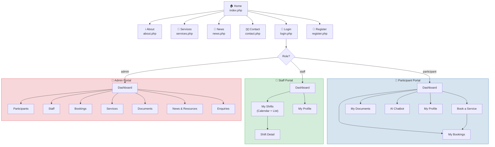
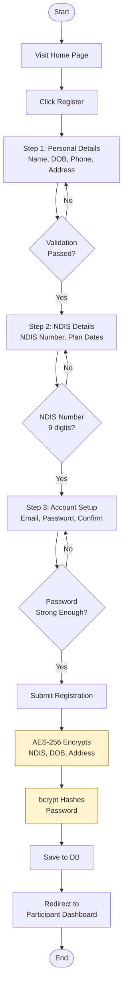
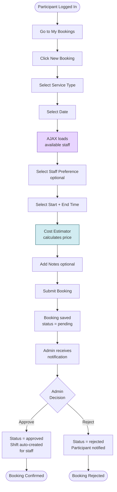
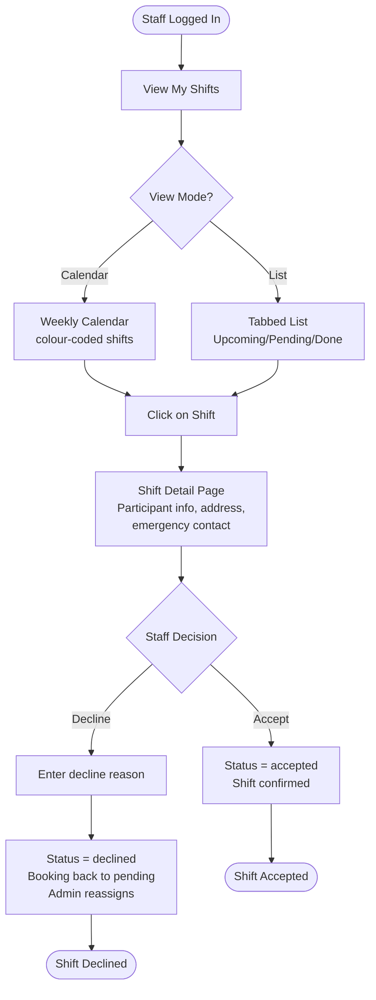
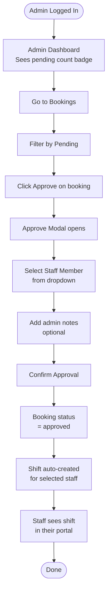

# Week 6 — UI/UX Design
## Adelaide Care Connect | CPRO306 Capstone Project
**Kent Institute Australia | Team: Group 8 | 2026**

---

## Table of Contents

1. [Design Overview](#1-design-overview)
2. [Design System](#2-design-system)
3. [Site Map & Navigation Structure](#3-site-map--navigation-structure)
4. [User Flow Diagrams](#4-user-flow-diagrams)
5. [Wireframes — Public Website](#5-wireframes--public-website)
6. [Wireframes — Participant Portal](#6-wireframes--participant-portal)
7. [Wireframes — Staff Portal](#7-wireframes--staff-portal)
8. [Wireframes — Admin Portal](#8-wireframes--admin-portal)
9. [UI Components Library](#9-ui-components-library)
10. [Accessibility Standards](#10-accessibility-standards)
11. [Responsive Design Breakpoints](#11-responsive-design-breakpoints)
12. [Deliverables Checklist](#12-deliverables-checklist)

---

## 1. Design Overview

| Property | Value |
|---|---|
| **Design Approach** | Mobile-first, accessibility-first |
| **Accessibility Standard** | WCAG 2.1 Level AA |
| **Responsive Range** | 320px (mobile) to 1920px (desktop) |
| **Total Pages** | 22 pages across 4 portals |
| **CSS Framework** | Custom CSS (no Bootstrap — pure CSS variables) |
| **Font Source** | Google Fonts (Poppins + Open Sans) |
| **Icon Library** | Font Awesome 6 |
| **Colour Contrast Ratio** | Minimum 4.5:1 for all body text (WCAG AA) |

---

## 2. Design System

### 2.1 Colour Palette

| Token | Hex Value | Preview | Usage |
|---|---|---|---|
| `--primary` | `#1F4E79` | 🟦 Navy Blue | Navigation bar, headings, primary buttons |
| `--primary-dark` | `#0F2D4A` | 🟦 Dark Navy | Sidebar background, footer |
| `--primary-light` | `#2E75B6` | 🔵 Mid Blue | Sub-headings, links, hover states |
| `--primary-xlight` | `#D6E4F0` | 🩵 Light Blue | Card backgrounds, info banners |
| `--accent` | `#F4A261` | 🟠 Warm Orange | CTA buttons, highlights, badges |
| `--success` | `#28A745` | 🟢 Green | Approved status, success alerts |
| `--warning` | `#FFC107` | 🟡 Amber | Pending status, warning alerts |
| `--error` | `#DC3545` | 🔴 Red | Rejected status, error messages |
| `--bg` | `#F8F9FA` | ⬜ Off White | Page background |
| `--bg-white` | `#FFFFFF` | ⬜ White | Card backgrounds |
| `--text-dark` | `#212529` | ⬛ Near Black | Body text |
| `--text-light` | `#6C757D` | 🔘 Gray | Secondary text, labels |
| `--border` | `#DEE2E6` | ─ Light Gray | Card borders, dividers |

### 2.2 Typography

| Element | Font | Weight | Size | Usage |
|---|---|---|---|---|
| H1 Heading | Poppins | 800 | 2rem (32px) | Page titles |
| H2 Heading | Poppins | 700 | 1.5rem (24px) | Section headings |
| H3 Heading | Poppins | 700 | 1.25rem (20px) | Card headings |
| H4 Heading | Poppins | 600 | 1rem (16px) | Sub-section headings |
| Body Text | Open Sans | 400 | 1rem (16px) | All paragraph text |
| Body Bold | Open Sans | 600 | 1rem (16px) | Emphasised body text |
| Small / Label | Open Sans | 600 | 0.875rem (14px) | Form labels, badges |
| Caption | Open Sans | 400 | 0.75rem (12px) | Helper text, timestamps |

### 2.3 Spacing Scale

```
--space-xs:   4px    (tight padding inside badges)
--space-sm:   8px    (button padding vertical)
--space-md:   16px   (card inner padding)
--space-lg:   24px   (section gaps)
--space-xl:   40px   (page section spacing)
--space-xxl:  64px   (hero section padding)
```

### 2.4 Border Radius Scale

```
--radius-sm:  4px    (input fields, small buttons)
--radius:     8px    (cards, modals)
--radius-lg:  12px   (large cards)
--radius-xl:  16px   (modals, hero sections)
--radius-full: 100px (pills, badges, avatar circles)
```

### 2.5 Shadow Scale

```
--shadow-sm:  0 1px 3px rgba(0,0,0,0.08)
--shadow:     0 4px 12px rgba(0,0,0,0.10)
--shadow-md:  0 8px 24px rgba(0,0,0,0.12)
--shadow-xl:  0 20px 48px rgba(0,0,0,0.18)
```

---

## 3. Site Map & Navigation Structure



---

## 4. User Flow Diagrams

### 4.1 Participant Registration Flow



### 4.2 Service Booking Flow



### 4.3 Staff Shift Management Flow



### 4.4 Admin Booking Approval Flow



---

## 5. Wireframes — Public Website

### 5.1 Home Page (`index.php`)

```
┌─────────────────────────────────────────────────────────┐
│  NAVBAR                                                   │
│  [Logo] Adelaide Care Connect    Home About Services ... [Login] [Register]│
├─────────────────────────────────────────────────────────┤
│  HERO SECTION (navy background)                          │
│                                                           │
│   ✓ NDIS Registered Provider                             │
│                                                           │
│   Quality NDIS Support Services                          │
│   in Adelaide                                             │
│                                                           │
│   Compassionate, participant-centred disability           │
│   support across South Australia.                        │
│                                                           │
│   [Register Now]    [View Services]                      │
│                                                           │
├─────────────────────────────────────────────────────────┤
│  OUR SERVICES (3-column grid)                            │
│  ┌──────────┐  ┌──────────┐  ┌──────────┐              │
│  │🏠 Daily  │  │👥 Commun.│  │💊 Therapy│              │
│  │Living    │  │Participat│  │Supports  │              │
│  │[Book Now]│  │[Book Now]│  │[Book Now]│              │
│  └──────────┘  └──────────┘  └──────────┘              │
├─────────────────────────────────────────────────────────┤
│  ABOUT SECTION (2 column)                                │
│  [Image]    We Put Participants First                    │
│             Adelaide Care Connect delivers...            │
│             [Learn More About Us]                        │
├─────────────────────────────────────────────────────────┤
│  CTA BANNER (navy)                                       │
│  Ready to Get Started?                                   │
│  [Create Account]    [Contact Us]                        │
├─────────────────────────────────────────────────────────┤
│  FOOTER                                                   │
│  Logo | Links | Contact | © 2026                        │
└─────────────────────────────────────────────────────────┘
```

### 5.2 Login Page (`login.php`)

```
┌─────────────────────────────────────────────────────────┐
│  SPLIT LAYOUT                                             │
│  ┌──────────────────────┬────────────────────────────┐  │
│  │  LEFT PANEL (navy)   │  RIGHT PANEL (white)       │  │
│  │                      │                            │  │
│  │  [ACC Logo]          │  Log In                    │  │
│  │                      │  Don't have an account?    │  │
│  │  Welcome Back        │  Register here             │  │
│  │                      │                            │  │
│  │  ✓ Book services     │  Email Address *           │  │
│  │  ✓ Store documents   │  [_________________________]│  │
│  │  ✓ AI assistant      │                            │  │
│  │  ✓ Real-time updates │  Password *                │  │
│  │                      │  [_________________________]│  │
│  │                      │                            │  │
│  │                      │  ☐ Remember me             │  │
│  │                      │  [Log In to My Portal]     │  │
│  │                      │                            │  │
│  │                      │  ─── or ───                │  │
│  │                      │  [Create New Account]      │  │
│  └──────────────────────┴────────────────────────────┘  │
└─────────────────────────────────────────────────────────┘
```

### 5.3 Registration Page (`register.php`) — 3-Step Form

```
┌─────────────────────────────────────────────────────────┐
│  PROGRESS INDICATOR                                       │
│  ●━━━━━━━━━○━━━━━━━━━○                                  │
│  1.Personal  2.NDIS  3.Account                          │
├─────────────────────────────────────────────────────────┤
│  STEP 1 — Personal Details                               │
│                                                           │
│  First Name *          Last Name *                       │
│  [___________]         [___________]                     │
│                                                           │
│  Date of Birth *       Phone Number *                    │
│  [___________]         [___________]                     │
│                                                           │
│  Street Address *                                         │
│  [_________________________________]                     │
│                                                           │
│  Suburb *              State    Postcode *               │
│  [___________]         [SA▾]    [____]                  │
│                                                           │
│  ── Emergency Contact ──────────────────────────────    │
│  Contact Name *        Contact Phone *                   │
│  [___________]         [___________]                     │
│                                                           │
│  Relationship [__________▾]                              │
│                                                           │
│  🔒 Your data is encrypted with AES-256                  │
│                              [Next: NDIS Details →]      │
└─────────────────────────────────────────────────────────┘
```

---

## 6. Wireframes — Participant Portal

### 6.1 Participant Dashboard

```
┌─────────────────────────────────────────────────────────┐
│  LAYOUT: Sidebar (left) + Main content (right)          │
│  ┌───────────┬────────────────────────────────────────┐ │
│  │  SIDEBAR  │  MAIN CONTENT                          │ │
│  │           │                                        │ │
│  │  [Avatar] │  Welcome back, Rabeel! 👋               │ │
│  │  Rabeel   │  Here's your NDIS support overview.   │ │
│  │  Particip.│                                        │ │
│  │           │  KPI CARDS (3 columns)                 │ │
│  │ ──────── │  ┌────────┐ ┌────────┐ ┌────────┐     │ │
│  │ Dashboard │  │   3    │ │   1    │ │   5    │     │ │
│  │ Bookings  │  │Bookings│ │Upcoming│ │  Docs  │     │ │
│  │ Documents │  └────────┘ └────────┘ └────────┘     │ │
│  │ AI Chat   │                                        │ │
│  │ Profile   │  RECENT BOOKINGS TABLE                 │ │
│  │           │  Service | Date | Status               │ │
│  │ ──────── │  Daily Living | 12 May | ✅ Approved   │ │
│  │ Logout    │  Community    | 15 May | 🕐 Pending   │ │
│  │           │                                        │ │
│  │           │  AI CHATBOT QUICK ACCESS               │ │
│  │           │  🤖 Ask me about your NDIS plan...     │ │
│  │           │  [Open Chatbot]                        │ │
│  └───────────┴────────────────────────────────────────┘ │
└─────────────────────────────────────────────────────────┘
```

### 6.2 Book a Service Modal

```
┌─────────────────────────────────────────────────────────┐
│  MODAL OVERLAY                                            │
│  ┌────────────────────────────────────────────────────┐ │
│  │  📅 Book a Service                              ✕  │ │
│  ├────────────────────────────────────────────────────┤ │
│  │                                                    │ │
│  │  Service *                                         │ │
│  │  [Daily Living Support ($67.56/hr) ▾]             │ │
│  │                                                    │ │
│  │  Preferred Date *    Preferred Staff               │ │
│  │  [dd/mm/yyyy    ]    [No preference  ▾]           │ │
│  │                                                    │ │
│  │  Start Time *        End Time *                   │ │
│  │  [9:00am        ▾]   [1:00pm       ▾]            │ │
│  │                                                    │ │
│  │  💰 Estimated cost: $270.24 (4hrs @ $67.56/hr)    │ │
│  │                                                    │ │
│  │  Additional Notes                                  │ │
│  │  [_________________________________________]       │ │
│  │                                                    │ │
│  │  [Cancel]              [Submit Booking]            │ │
│  │                                                    │ │
│  │  Bookings confirmed within 1 business day.        │ │
│  └────────────────────────────────────────────────────┘ │
└─────────────────────────────────────────────────────────┘
```

### 6.3 AI Chatbot Page

```
┌─────────────────────────────────────────────────────────┐
│  ┌───────────┬────────────────────────────────────────┐ │
│  │  SIDEBAR  │  🤖 AI NDIS Assistant                  │ │
│  │  (same)   │  General information only disclaimer   │ │
│  │           │                                        │ │
│  │           │  CHAT WINDOW                           │ │
│  │           │  ┌──────────────────────────────────┐ │ │
│  │           │  │ 🤖 Hello Rabeel! I am your AI   │ │ │
│  │           │  │    NDIS Assistant. I can help... │ │ │
│  │           │  │                                  │ │ │
│  │           │  │ [What is NDIS?] [How to book?]  │ │ │
│  │           │  │ [What services?] [Plan budget?] │ │ │
│  │           │  │                                  │ │ │
│  │           │  │              Hi                  │ │ │
│  │           │  │              10:05am         [R] │ │ │
│  │           │  │                                  │ │ │
│  │           │  │ 🤖 Adelaide Care Connect offers: │ │ │
│  │           │  │    • Daily Living Support        │ │ │
│  │           │  │    • Community Participation     │ │ │
│  │           │  │    10:05am                       │ │ │
│  │           │  └──────────────────────────────────┘ │ │
│  │           │                                        │ │
│  │           │  [Ask me about NDIS...         ] [➤]  │ │
│  │           │  0/1000 characters                     │ │
│  └───────────┴────────────────────────────────────────┘ │
└─────────────────────────────────────────────────────────┘
```

### 6.4 My Documents Page

```
┌─────────────────────────────────────────────────────────┐
│  ┌───────────┬────────────────────────────────────────┐ │
│  │  SIDEBAR  │  My Documents              [+ Upload]  │ │
│  │           │  Manage your NDIS documents securely   │ │
│  │           │                                        │ │
│  │           │  KPI CARDS                             │ │
│  │           │  [5 Total] [2.3 MB Used] [🔒 AES-256] │ │
│  │           │                                        │ │
│  │           │  🔒 All files encrypted with AES-256   │ │
│  │           │                                        │ │
│  │           │  DOCUMENTS GRID (3 columns)            │ │
│  │           │  ┌──────────┐ ┌──────────┐            │ │
│  │           │  │📄 NDIS   │ │📄 Progress│            │ │
│  │           │  │Plan.pdf  │ │Note.pdf  │            │ │
│  │           │  │245 KB    │ │128 KB    │            │ │
│  │           │  │[👁 View] │ │[👁 View] │            │ │
│  │           │  │[↓][🗑️]  │ │[↓][🗑️]  │            │ │
│  │           │  └──────────┘ └──────────┘            │ │
│  └───────────┴────────────────────────────────────────┘ │
└─────────────────────────────────────────────────────────┘
```

---

## 7. Wireframes — Staff Portal

### 7.1 Staff Shifts — Calendar View

```
┌─────────────────────────────────────────────────────────┐
│  ┌───────────┬────────────────────────────────────────┐ │
│  │  SIDEBAR  │  My Shifts            [≡ List][📅 Cal] │ │
│  │  [Avatar] │                                        │ │
│  │  Sarah J  │  ⚠ You have 2 shifts awaiting response │ │
│  │  Support  │                                        │ │
│  │           │  [◀ Prev]  12 May – 18 May 2026  [▶]  │ │
│  │ Dashboard │                                        │ │
│  │ My Shifts │  MON  TUE  WED  THU  FRI  SAT  SUN    │ │
│  │ Profile   │   12   13   14   15   16   17   18     │ │
│  │           │  ┌───┐     ┌───┐          ┌───┐       │ │
│  │           │  │9am│     │10a│          │2pm│       │ │
│  │           │  │DLS│     │CP │          │TS │       │ │
│  │           │  │🟡 │     │🟢 │          │🟡 │       │ │
│  │           │  └───┘     └───┘          └───┘       │ │
│  │           │                                        │ │
│  │           │  🟡 Awaiting  🟢 Accepted  🔴 Declined │ │
│  └───────────┴────────────────────────────────────────┘ │
└─────────────────────────────────────────────────────────┘
```

### 7.2 Shift Detail Page

```
┌─────────────────────────────────────────────────────────┐
│  ┌───────────┬────────────────────────────────────────┐ │
│  │  SIDEBAR  │  ← Back to Shifts                      │ │
│  │           │                                        │ │
│  │           │  ┌──────────────────┐ ┌────────────┐  │ │
│  │           │  │ SHIFT DETAILS    │ │  ACTIONS   │  │ │
│  │           │  │                  │ │            │  │ │
│  │           │  │ 🏠 Daily Living  │ │ ⚠ Response │  │ │
│  │           │  │    Support       │ │  Required  │  │ │
│  │           │  │                  │ │            │  │ │
│  │           │  │ 📅 Mon 12 May    │ │ [✓ Accept] │  │ │
│  │           │  │ 🕐 9am – 1pm     │ │            │  │ │
│  │           │  │ ⏱ 4 hours        │ │ [✗ Decline]│  │ │
│  │           │  │ 💰 Est: $270.24  │ │            │  │ │
│  │           │  │                  │ │ ┌────────┐  │  │ │
│  │           │  │ PARTICIPANT INFO  │ │ │Summary │  │  │ │
│  │           │  │ 👤 Rabeel Riasat  │ │ │Date    │  │  │ │
│  │           │  │ 📞 0400 000 000  │ │ │Time    │  │  │ │
│  │           │  │ 📍 12 Main St SA │ │ │Service │  │  │ │
│  │           │  │                  │ │ └────────┘  │  │ │
│  │           │  │ 🚨 EMERGENCY     │ │            │  │ │
│  │           │  │ Jane Riasat      │ │            │  │ │
│  │           │  │ (Mother) 0411... │ │            │  │ │
│  │           │  └──────────────────┘ └────────────┘  │ │
│  └───────────┴────────────────────────────────────────┘ │
└─────────────────────────────────────────────────────────┘
```

---

## 8. Wireframes — Admin Portal

### 8.1 Admin Dashboard

```
┌─────────────────────────────────────────────────────────┐
│  ┌───────────┬────────────────────────────────────────┐ │
│  │  SIDEBAR  │  Admin Dashboard          Fri 16 May   │ │
│  │  [Avatar] │  Welcome back, Admin.                  │ │
│  │  Admin    │                                        │ │
│  │           │  KPI ROW 1 (4 cards)                   │ │
│  │ Dashboard │  ┌──────┐┌──────┐┌──────┐┌──────┐    │ │
│  │ Particip. │  │  42  ││   8  ││   5  ││   3  │    │ │
│  │ Staff     │  │Parts ││Staff ││Pendng││Enquir│    │ │
│  │ Bookings🔴│  └──────┘└──────┘└──────┘└──────┘    │ │
│  │ Services  │                                        │ │
│  │ Documents │  KPI ROW 2 (4 cards)                   │ │
│  │ News      │  ┌──────┐┌──────┐┌──────┐┌──────┐    │ │
│  │ Enquiries │  │  67  ││  45  ││  23  ││   8  │    │ │
│  │           │  │Total ││Apprvd││ Docs ││Posts │    │ │
│  │ Logout    │  └──────┘└──────┘└──────┘└──────┘    │ │
│  │           │                                        │ │
│  │           │  ┌─────────────────┬────────────────┐  │ │
│  │           │  │ RECENT BOOKINGS │ ACTIVITY FEED  │  │ │
│  │           │  │ Name | Svc | St │ 📅 New booking  │  │ │
│  │           │  │ R.R  | DLS |🕐 │ ✉ New enquiry  │  │ │
│  │           │  │ S.S  | CP  |✅ │ ✓ Booking appr │  │ │
│  │           │  └─────────────────┴────────────────┘  │ │
│  └───────────┴────────────────────────────────────────┘ │
└─────────────────────────────────────────────────────────┘
```

### 8.2 Admin Bookings Page

```
┌─────────────────────────────────────────────────────────┐
│  ┌───────────┬────────────────────────────────────────┐ │
│  │  SIDEBAR  │  Bookings                              │ │
│  │           │                                        │ │
│  │           │  STATUS CARDS                          │ │
│  │           │  [5 Pending][45 Approved][3 Rejected]  │ │
│  │           │                                        │ │
│  │           │  [Search...     ] [Status ▾] [Filter]  │ │
│  │           │                                        │ │
│  │           │  TABLE                                 │ │
│  │           │  # | Participant | Service | Date      │ │
│  │           │  ─────────────────────────────────     │ │
│  │           │  1 | Rabeel R.   | Daily   | 12 May    │ │
│  │           │    |             | Living  | 🕐Pending  │ │
│  │           │    |             |         |[✓][✗]     │ │
│  │           │  ─────────────────────────────────     │ │
│  │           │  2 | Sanup S.    | Therapy | 14 May    │ │
│  │           │    |             |         | 🕐Pending  │ │
│  │           │    |             |         |[✓][✗]     │ │
│  └───────────┴────────────────────────────────────────┘ │
│                                                           │
│  APPROVE MODAL                                            │
│  ┌────────────────────────────────────────────────────┐ │
│  │ ✓ Approve Booking                               ✕  │ │
│  │ Rabeel Riasat — Daily Living — 12 May             │ │
│  │                                                    │ │
│  │ Assign Support Worker                              │ │
│  │ [Sarah Johnson (Support Worker)  ▾]               │ │
│  │ Assigning creates a shift automatically            │ │
│  │                                                    │ │
│  │ Admin Notes (optional)                             │ │
│  │ [_________________________________________]        │ │
│  │                                                    │ │
│  │ [Cancel]                [✓ Confirm Approval]       │ │
│  └────────────────────────────────────────────────────┘ │
└─────────────────────────────────────────────────────────┘
```

---

## 9. UI Components Library

### 9.1 Buttons

| Variant | Usage | Style |
|---|---|---|
| `btn--primary` | Main actions (Submit, Save, Book) | Navy fill, white text |
| `btn--accent` | CTA buttons (Register Now) | Orange fill, dark text |
| `btn--ghost` | Secondary actions (Cancel, Back) | Transparent, navy border |
| `btn--danger` | Destructive actions (Delete, Decline) | Red fill, white text |
| `btn--outline` | Tertiary actions (View Details) | Transparent, gray border |
| `btn--sm` | Table row actions, inline buttons | 0.75rem font, reduced padding |
| `btn--lg` | Hero section CTAs | 1.1rem font, extra padding |
| `btn--full` | Full-width form buttons | 100% width |

### 9.2 Status Badges

| Badge | Colour | Usage |
|---|---|---|
| `badge--pending` | Amber background | Booking awaiting approval |
| `badge--approved` | Green background | Booking confirmed |
| `badge--rejected` | Red background | Booking rejected |
| `badge--cancelled` | Gray background | Booking cancelled |
| `badge--completed` | Navy background | Service completed |
| `badge--assigned` | Amber background | Shift assigned to staff |
| `badge--accepted` | Green background | Staff accepted shift |
| `badge--declined` | Red background | Staff declined shift |
| `badge--admin` | Red background | Admin role indicator |
| `badge--participant` | Blue background | Participant role indicator |

### 9.3 Form Components

| Component | Description |
|---|---|
| `form-group` | Label + input wrapper with consistent spacing |
| `form-control` | Styled input, textarea, select — 1.5px navy border on focus |
| `form-label` | Bold 0.875rem label above each field |
| `form-hint` | Small gray helper text below a field |
| `required` | Orange asterisk on required field labels |
| `password-toggle` | Eye icon button to show/hide password |
| `password-strength` | Animated bar showing password strength |
| `form-row` | 2-column grid layout for paired fields |
| `form-check` | Styled checkbox with custom appearance |

### 9.4 Card Components

| Component | Description |
|---|---|
| `dash-card` | Main dashboard card with header and body sections |
| `kpi-card` | Stat card with icon circle, number, and label |
| `kpi-card__icon--blue` | Blue icon background (participants, bookings) |
| `kpi-card__icon--green` | Green icon background (approved, staff) |
| `kpi-card__icon--orange` | Orange icon background (pending) |
| `kpi-card__icon--red` | Red icon background (errors, rejected) |

### 9.5 Alert Components

| Alert Type | Colour | Usage |
|---|---|---|
| `alert--success` | Green | Successful save, booking confirmed |
| `alert--error` | Red | Validation failed, access denied |
| `alert--warning` | Amber | Pending actions, 24hr cancellation warning |
| `alert--info` | Blue | General information, encryption notice |

---

## 10. Accessibility Standards

### WCAG 2.1 Level AA Compliance

| Requirement | Standard | Implementation |
|---|---|---|
| **Colour Contrast** | Min 4.5:1 for normal text | Navy `#1F4E79` on white = 9.7:1 ✅ |
| **Focus Indicators** | Visible keyboard focus ring | 3px navy box-shadow on focus ✅ |
| **Keyboard Navigation** | All interactive elements reachable by Tab | Tab order follows visual reading order ✅ |
| **Form Labels** | Every input has an associated label | All inputs have matching `for` + `id` ✅ |
| **Error Identification** | Errors described in text | Inline error messages below each field ✅ |
| **Language** | Page language declared | `<html lang="en">` on all pages ✅ |
| **Font Size** | Minimum 16px base | Base font 1rem (16px) in CSS ✅ |
| **Link Purpose** | Links describe their destination | No "click here" links — descriptive text only ✅ |
| **Resize Text** | Text resizable to 200% without loss | Em/rem units used throughout ✅ |
| **Plain Language** | Content readable at age 8-10 level | Short sentences, plain English throughout ✅ |

---

## 11. Responsive Design Breakpoints

| Breakpoint | Width | Layout Changes |
|---|---|---|
| **Mobile** | 320px – 767px | Single column, hamburger menu, stacked cards |
| **Tablet** | 768px – 1023px | 2-column grid, collapsible sidebar |
| **Desktop** | 1024px – 1439px | Full sidebar visible, 3-4 column grids |
| **Wide Desktop** | 1440px+ | Max content width 1400px, centered |

### Key Responsive Behaviours

- **Navigation:** Full navbar on desktop → hamburger menu icon on mobile
- **Dashboard sidebar:** Fixed sidebar on desktop → slides in from left on mobile
- **KPI cards:** 4-column on desktop → 2-column on tablet → 1-column on mobile
- **Tables:** Horizontal scroll on mobile, full display on desktop
- **Modals:** Full width on mobile with smaller padding, centered fixed width on desktop
- **Forms:** 2-column layout on desktop → single column on mobile

---

## 12. Deliverables Checklist

| Deliverable | Status | File Location |
|---|---|---|
| Colour palette and design tokens | ✅ Complete | `assets/css/style.css` — CSS variables |
| Typography scale | ✅ Complete | `assets/css/style.css` — font definitions |
| Spacing and border radius scale | ✅ Complete | `assets/css/style.css` — CSS variables |
| Site map and navigation structure | ✅ Complete | See Section 3 above |
| Participant registration flow | ✅ Complete | See Section 4.1 above |
| Service booking flow | ✅ Complete | See Section 4.2 above |
| Staff shift management flow | ✅ Complete | See Section 4.3 above |
| Admin booking approval flow | ✅ Complete | See Section 4.4 above |
| Public website wireframes | ✅ Complete | See Section 5 above |
| Participant portal wireframes | ✅ Complete | See Section 6 above |
| Staff portal wireframes | ✅ Complete | See Section 7 above |
| Admin portal wireframes | ✅ Complete | See Section 8 above |
| UI components library | ✅ Complete | See Section 9 above |
| Accessibility compliance table | ✅ Complete | See Section 10 above |
| Responsive breakpoints | ✅ Complete | See Section 11 above |
| Wireframe PNG diagrams | ✅ Complete | `docs/wireframes/diagram_E_wireframes.png` |

---

*Adelaide Care Connect | CPRO306 Capstone Project | Kent Institute Australia | Week 6 Deliverable | 2026*
